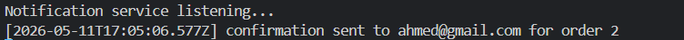

# projectServices_API - NestJS Microservices

Distributed ordering platform built with 5 NestJS services and four communication styles: REST, gRPC, Kafka, and GraphQL.

## 1. Architecture and Roles

Flow overview:

- Client -> REST -> catalog-service
- Client -> REST -> order-service -> gRPC -> stock-service
- order-service -> Kafka topic `order.created` -> notification-service
- Client -> GraphQL -> query-service -> REST -> catalog-service and order-service

## 2. Services and Ports

| Service | Responsibility | Port | Protocol |
|---------|----------------|------|----------|
| **catalog-service** | Product CRUD | 3000 | HTTP REST |
| **order-service** | Create and list orders | 3001 | HTTP REST + gRPC client + Kafka producer |
| **stock-service** | Stock check and reservation | 50051 | gRPC |
| **notification-service** | Consume order events and log notifications | - | Kafka consumer (`localhost:9092`) |
| **query-service** | Aggregated read API (`products`, `orders`) | 3002 | GraphQL over HTTP |

Infrastructure:

- Kafka: `localhost:9092`
- Zookeeper: `localhost:2181`

---

## Prerequisites

- Node.js 18+
- npm
- Docker Desktop (for Kafka & Zookeeper)

---

## Setup

### 1. Install Dependencies

```bash
cd catalog-service && npm install
cd ../order-service && npm install
cd ../stock-service && npm install
cd ../notification-service && npm install
cd ../query-service && npm install
cd ..
```

### 2. Start Kafka & Zookeeper

```bash
docker compose up -d
```

Stop infrastructure:
```bash
docker compose down
```

---

## Startup Commands

Start each service in a separate terminal:

### catalog-service (Port 3000)
```bash
cd catalog-service
npm run start:dev
```

### order-service (Port 3001)
```bash
cd order-service
npm run start:dev
```

### stock-service (Port 50051 - gRPC)
```bash
cd stock-service
npm run start:dev
```

### notification-service (Kafka Consumer)
```bash
cd notification-service
npm run start:dev
```

### query-service (Port 3002 - GraphQL)
```bash
cd query-service
npm run start:dev
```

---

## Test Scenarios

### Scenario 1: Create a Product (Catalog Service)

**Request screenshot**


**Response screenshot**


---

### Scenario 2: Get All Products

**Request screenshot**


**Response screenshot**


---

### Scenario 3: Get One Product

**Request screenshot**


**Response screenshot**


---

### Scenario 4: Update a Product

**Request screenshot**


**Response screenshot**


---

### Scenario 5: Delete a Product

**Request screenshot**


**Response screenshot**


---

### Scenario 6: Create an Order (Order Service)

**Request screenshot**

.png)

**Response screenshot**

.png)

**Expected flow:**
1. Order service calls stock-service via gRPC (CheckAndReserve)
2. Stock is checked and reserved
3. Order is created with status "CONFIRMED"
4. Kafka event `order.created` is published
5. Notification service logs the confirmation

---
### Scenario 7: Insufficient Stock Test

**Request screenshot**


**Response screenshot**


---

### Scenario 8: Notification Service Log

When an order is created, the notification service logs:



---

### Scenario 9: Get All Orders

**Request screenshot**


**Response screenshot**


---

### Scenario 10: Query Orders via GraphQL (Query Service)

**URL:** http://localhost:3002/graphql

query {
  orders {
    id
    productId
    quantity
    status
  }
}

**Query screenshot**


**Response screenshot**


---

### Scenario 11: Query Products via GraphQL

query {
  products {
    id
    name
    price
    stock
  }
}

**Query screenshot**


**Response screenshot**


---

## Running Tests

```bash
# Unit tests
cd <service-folder>
npm run test

# E2E tests
npm run test:e2e
```

---

## Build for Production

```bash
cd <service-folder>
npm run build
npm run start:prod
```

---

## Notes

- All data is stored in-memory (not persisted to a database)
- Stock service uses a Map to track product inventory
- Kafka is used for asynchronous order notifications
- gRPC is used for synchronous stock validation between order and stock services
